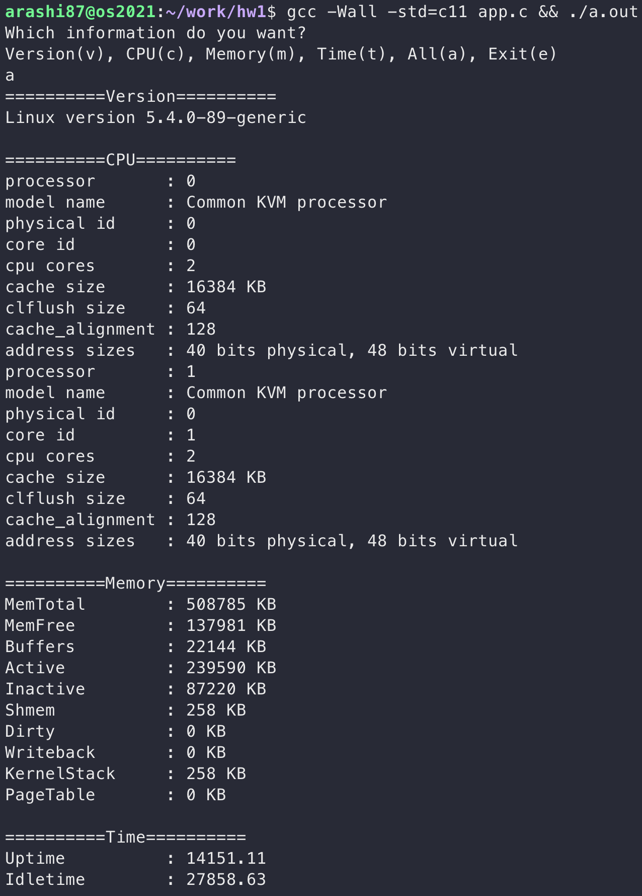

# OS_LKM_Build

This is school os class' homework, need to build a linux kernel module, and provide following function.

* Get cpu, mem, time and version's infomation from linux kernel.
* Use the above info to build a proc file in `/proc/my_info`.
* Provide interface to get these info, and it can only get data by proc file which build by self.

All reference come from [bootlin](https://elixir.bootlin.com/). I use seq_file and single_open to bypass 4k boundary, and this assignment was done on linux 5.15.

## Version
Just come from `generated/utsrelease.h` and easily to get from `UTS_RELEASE`.

## Cpuinfo
Refer to `/arch/x86/kernel/cpu/proc.c` and include `linux/cpufreq.h`, the pseudo will look like this.

```c
struct cpuinfo_x86* c = (void*)&cpu_data(pos);
```

Provid the following info.

* processor
* model name
* physical id 
* core id 
* cpu cores
* cache size
* clflush size
* cache_alignment
* address sizes

## Meminfo
Refer to `/fs/proc/meminfo.c` and include `linux/swap.h`, the pseudo will look like this.

```c
struct sysinfo i;
si_meminfo(&i);
```

The most interesting part is in the same place as linux source also provide `si_swapinfo(&i)`, but have no idea why is will failed, so just removed it. The following is the info provided.

* MemTotal
* MemFree
* Buffers
* Active
* Inactive
* Shmem
* Dirty
* Writeback
* KernelStack
* PageTable

# Time
This part only need provide `uptime` and `idletime`, I also referred from `/fs/proc/uptime.c`, and include `linux/time.h`, and here is the same problem as the above point, source code provide `timens_add_boottime(&uptime)`, but still failed, so i removed it too, following is pseudo code.

```c
struct timespec64 uptime;
    struct timespec64 idle;
    u64 nsec;
    u32 rem;
    int i;

    nsec = 0;
    for_each_possible_cpu(i)
    nsec += (__force u64) kcpustat_cpu(i).cpustat[CPUTIME_IDLE];

    ktime_get_boottime_ts64(&uptime);

    idle.tv_sec = div_u64_rem(nsec, NSEC_PER_SEC, &rem);
    idle.tv_nsec = rem;
```

## Result
Here is final result, I finally finished my homework >< !

